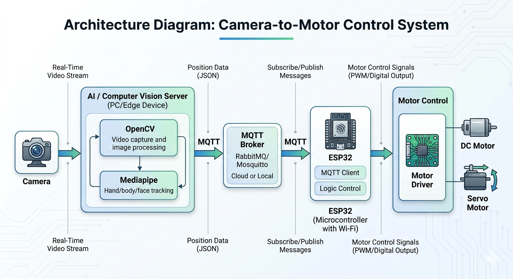
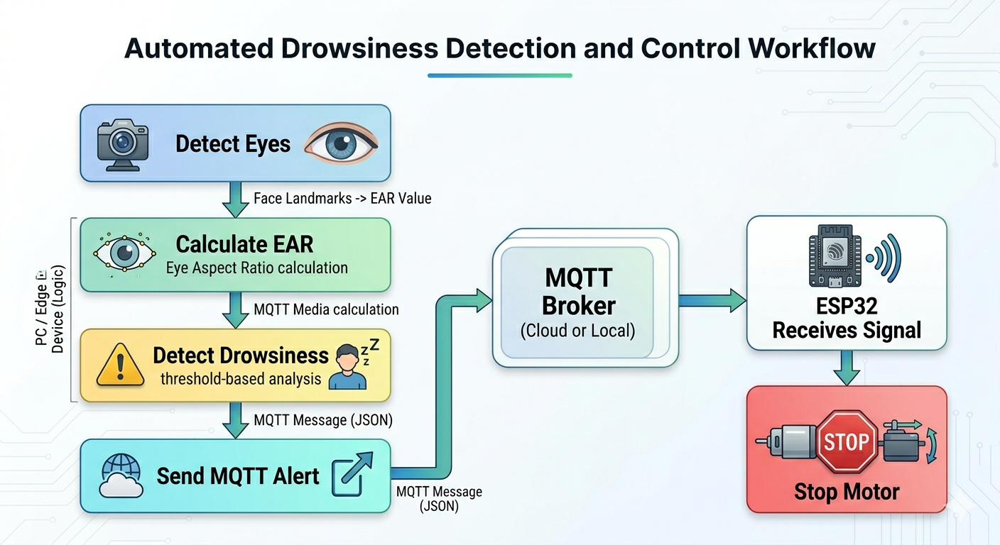

# Smart Driver Monitoring System

## Overview

An AI-powered smart driver monitoring system designed to detect driver drowsiness in real-time using Computer Vision, MQTT communication, and ESP32 embedded control systems.

The system integrates OpenCV, Mediapipe, ESP32, MQTT, and ESP-NOW technologies to improve vehicle safety.

---

## Features

- Real-time drowsiness detection
- Eye Aspect Ratio (EAR) monitoring
- MQTT communication
- ESP32 motor control
- Driver alert notifications
- Automatic motor shutdown

---

## Technologies Used

- Python
- OpenCV
- Mediapipe
- MQTT
- ESP32
- ESP-NOW
- Computer Vision

---

## Project Architecture



---

## Workflow



---

## Installation

```bash
pip install -r requirements.txt
```

---

## Run the AI Detection System

```bash
python pc_ai/driver_monitor.py
```

---

## Engineering Concepts Applied

- Real-Time Computer Vision
- Embedded Systems
- MQTT Communication
- Human Safety Systems
- IoT Monitoring
- ESP-NOW Communication

---

## Future Improvements

- Mobile Application Integration
- Cloud Dashboard
- Real-time Notifications
- GPS Integration
- AI Fatigue Prediction
