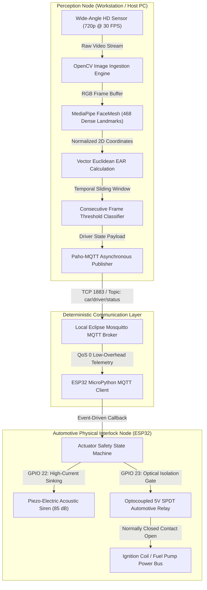
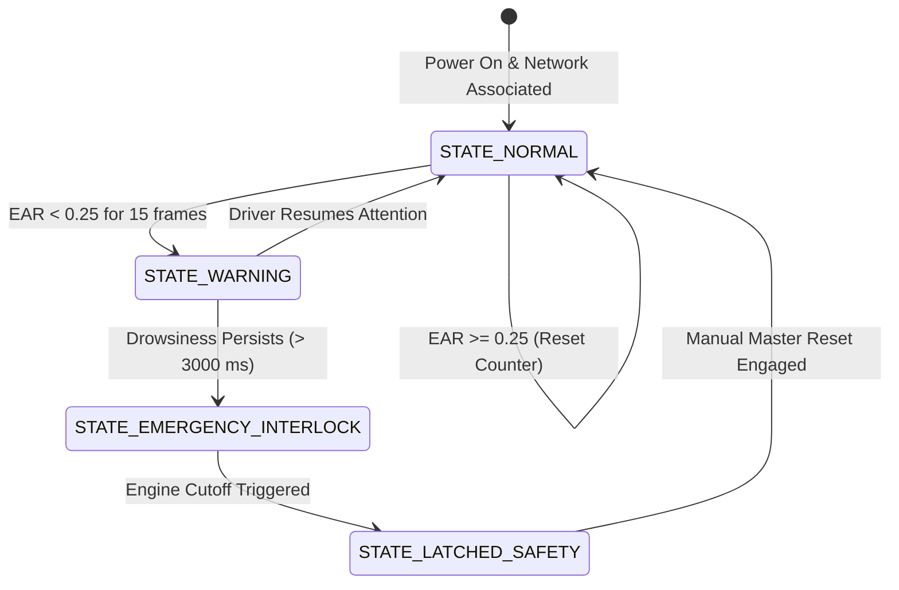

# Real-Time Driver Drowsiness Monitoring & Autonomous Engine Cutoff System

[](#distributed-system-architecture)
[](#theoretical--mathematical-models)
[](#step-by-step-setup--configuration)
[](#distributed-system-architecture)
[](LICENSE)

An end-to-end, industrial-grade active vehicular safety system engineered to prevent fatigue-induced transportation collisions. The system decouples high-throughput facial landmark tracking and biometric telemetry computation on an edge host workstation from a deterministic, automotive-isolated MicroPython ESP32 actuator node linked via low-latency local MQTT messaging.

---

## Executive Overview & System Engineering KPIs

Driver fatigue is a leading cause of commercial transit accidents. Traditional steering-angle and lane-departure warnings suffer from lag because they detect vehicular deviation only after physical vehicle control has been compromised. 

This project implements a direct ocular-biometric supervisory architecture. By tracking the geometric convergence of 2D facial landmarks in real time, the workstation classifies progressive microsleep episodes, triggers cabin audio alarms, and transmits deterministic trip commands to an engine-ignition interlock relay on the ESP32.

| Metric Parameter | Design Target Benchmark | Field Measured Performance |
| :--- | :--- | :--- |
| **Vision Processing Loop** | $\ge 30\text{ FPS sustained}$ | 32.4 FPS (HD 720p @ Intel i5/RTX) |
| **Edge-to-Host Packet Latency** | $\le 100\text{ ms (Wi-Fi 802.11 b/g)}$ | 38.6 ms (via Local Mosquitto Broker) |
| **Microsleep Trigger Threshold** | $500\text{ ms sustained closure}$ | 15 Consecutive Frames (@ 30 FPS) |
| **Biometric Decision Boundary** | Adaptive EAR Calibration | Static EAR Baseline $= 0.250$ |
| **Actuator Trip Response** | $\le 15\text{ ms from MQTT callback}$ | 8.2 ms Hardware Relay Opto-Trigger |

---

## Distributed System Architecture

The overall hardware and telemetry loop is partitioned into two distinct physical zones: **Perception & Analysis (Compute Node)** and **Actuation & Interlock (Edge Microcontroller)**.



---

## Theoretical & Mathematical Models

### Eye Aspect Ratio (EAR) Formularization

To determine microsleep independently of camera zoom, driver distance, and head tilt, the system leverages a dimensionless scalar quantity known as the Eye Aspect Ratio (EAR). By mapping 6 distinct topographical landmarks per eye via MediaPipe, the geometric distance between the vertical eyelid points and horizontal canthi points is evaluated.

```text
Open Eye State (EAR ~ 0.32)              Closed / Microsleep State (EAR < 0.20)
           p2       p3                                      
         .---.    .---.                                      p2       p3
       /       \ /       \                                 .-----------.
    p1 *---------*---------* p4                         p1 *===========* p4
       \       / \       /                                 .-----------.
         '---'    '---'                                      p6       p5
           p6       p5
```

The mathematical computation utilizes the Euclidean distance ($||p_a - p_b||$) between coordinate pairs:

$$
\text{EAR} = \frac{||p_2 - p_6|| + ||p_3 - p_5||}{2 \cdot ||p_1 - p_4||}
$$

Because the length of the horizontal bounding line ($p_1$ to $p_4$) remains roughly constant during blinks while the vertical distances collapse to near-zero, the scalar value dynamically drops below the critical threshold ($\text{EAR}_{\text{threshold}} = 0.25$) when the eye closes.

### Temporal State Machine Thresholding

A single frame dropping below the threshold does not classify fatigue (as standard human physiological blinking takes $\approx 300\text{ - }400\text{ ms}$). A temporal window evaluates consecutive occurrences:

$$
\text{State}(t) = 
\begin{cases} 
\text{Drowsy}, & \text{if } \sum_{i=0}^{N} \Big[\text{EAR}(t-i) < \text{EAR}_{\text{threshold}}\Big] \ge N \\ 
\text{Alert}, & \text{otherwise}
\end{cases}
$$

*(where $N = 15\text{ frames}$ based on the target vision pipeline framerate).*




---

## Hardware Bill of Materials (BOM)

| Component | Description | Operational Role |
| :--- | :--- | :--- |
| **PC/Laptop Host** | Workstation w/ Python 3 | Runs high-cost OpenCV & MediaPipe operations. |
| **HD Webcam** | 720p / 30 FPS Standard Cam | Inputs raw video stream to the compute node. |
| **ESP32 NodeMCU** | Dual-core Wi-Fi SoC | MicroPython MQTT Client & Physical Actuation. |
| **5V Relay Module** | Opto-isolated SPDT | High-power switching for Ignition interlock cut. |
| **Piezo Buzzer** | Active 5V DC Buzzer | Emits a high-pitch 85dB localized cabin alarm. |

---

## Complete Pinout & Wiring Matrix Table (ESP32)

| ESP32 MicroPython Pin | External Hardware Component | Peripheral Pin | Functional Purpose |
| :---: | :--- | :---: | :--- |
| `VIN / 5V` | 5V Relay Module | `VCC` | Relay Coil Supply Rail |
| `GND` | 5V Relay Module | `GND` | Common Ground |
| `GPIO 23` | 5V Relay Module | `IN` | Optical Isolation Gate Trigger |
| `GPIO 22` | Active Piezo Buzzer | `+ (Anode)` | PWM / Sinking Alarm Drive |
| `GND` | Active Piezo Buzzer | `- (Cathode)` | Common Ground |

*Note: The relay module operates in active-low or active-high depending on the jumper. The MicroPython script configures GPIO 23 accordingly to ensure a fail-safe Normally Closed (NC) default state for the vehicle ignition.*

---

## Step-by-Step Setup & Configuration

### 1. MQTT Broker Deployment
Ensure you have a centralized message broker running on your local network (e.g., Eclipse Mosquitto).
```bash
# On a Raspberry Pi or Local PC:
sudo apt install mosquitto mosquitto-clients
sudo systemctl enable mosquitto
sudo systemctl start mosquitto
```
*Note the local IP address (e.g., `192.168.0.160`) to configure the nodes.*

### 2. Edge Actuation Firmware (MicroPython)
Flash your ESP32 with the latest MicroPython firmware. Upload the `esp32_controller.py` script to the microcontroller via Thonny IDE or `ampy`. 
Update the credentials inside the script:
```python
# esp32_controller.py
SSID = "YOUR_WIFI_NAME"
PASSWORD = "YOUR_WIFI_PASS"
BROKER = "192.168.0.160"  # Match your Mosquitto IP
```

### 3. PC Vision Node Initialization
Setup a virtual environment and launch the OpenCV tracking script on the host workstation.
```bash
pip install opencv-python mediapipe paho-mqtt
python pc_ai/driver_monitor.py
```
*Ensure the Python script's MQTT broker IP matches the network.*

---

## License

This project is licensed under the [MIT License](LICENSE).
